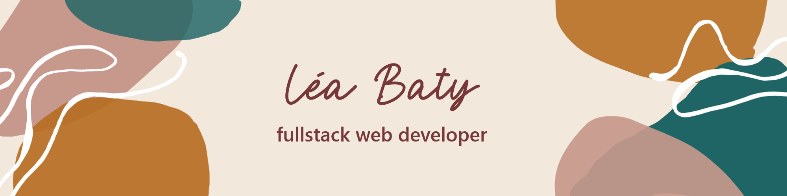
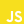
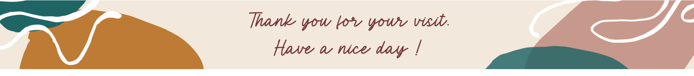

<link rel="stylesheet" type="text/css" media="all" href="./styles.css" />

# Hello there ! 

I'm Léa, a **fullstack web developer** based in Paris, France. I just graduated from O'Clock 🥇, a full online school that helped me cover the basics of web development . I am now **consolidating my learning** with the development of several projects that you will find on this profile !

💬 Don't hesitate to reach out to me, I would be happy to exchange : You can also find me on  

 

## 🙌 I love to play with... 

 

  |   |  |   |  |   |   |   |   |   |
|:---:|:---:|:---:|:---:|:---:|:---:|:---:|:---:|:---:|:---:|
| HTML5   |  CSS3 | Javascript ES6  | React.js  |  Redux.js | Sass  | Node.js  | PostgreSQL  | Git  | Figma  |

 

## 🧠 I'm currently learning...

 

 |  |   	|
| :---:	| :---:	|:---:	|
| Webpack 	|  AWS	|  	GraphQL|

 

## 📈 GitHub Stats

---

 

## ⭐ My favorite projects

---

These are my favorite projects at the moment. More coming soon ! 🚀

 

 

